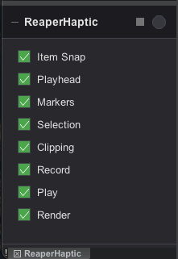

# ReaperHaptic

[](../../releases)
[](https://opensource.org/licenses/MIT)
[](https://www.apple.com/macos)
[](https://dotnet.microsoft.com/)
[](https://www.reaper.fm/)

**Haptic feedback for Logitech MX Master 4 mouse, triggered by REAPER DAW events.**

Feel your edits - get tactile feedback when items snap together, when audio clips, when recording starts, and more.

---

## Features

| Feature | Description |
|---------|-------------|
| **Item Snap Detection** | Haptic "click" when items touch other items, markers, time selection, or playhead |
| **Clipping Alert** | Strong vibration when master track exceeds 0dB |
| **Transport Feedback** | Subtle haptics for record/play start and stop |
| **Render Complete** | Notification when rendering finishes |
| **Marker Crossing** | Light feedback when playhead crosses markers during playback |

## Screenshot

<p align="center">
  
</p>

The configuration panel lets you toggle individual haptic events on/off. The LED indicator flashes green when haptic feedback is sent. Supports docking in REAPER's Docker.

## Requirements

- **macOS** 14+ (Sonoma or later)
- **Logitech MX Master 4** mouse with haptic feedback
- **Logi Options+** installed and running
- **REAPER** 7.0+ DAW
- **.NET 8 SDK** (for building from source)

## Installation

### Step 1: Install the Plugin

#### Option A: Download Pre-built Package (Recommended)

1. Download `ReaperHaptic.lplug4` from [Releases](../../releases)
2. Double-click to install, or copy to:
   ```
   ~/Library/Application Support/Logi/LogiPluginService/Plugins/
   ```
3. Restart Logi Options+

#### Option B: Build from Source

```bash
# Clone the repository
git clone https://github.com/b451c/ReaperHaptic.git
cd ReaperHaptic

# Install .NET 8 SDK (if not installed)
brew install dotnet-sdk@8

# Build and install
./build.sh
```

### Step 2: Install REAPER Script

The Lua script monitors REAPER events and sends OSC messages to the plugin.

```bash
# Copy the script to REAPER's Scripts folder
cp scripts/reaper_haptic_monitor.lua ~/Library/Application\ Support/REAPER/Scripts/
```

Then in REAPER:
1. **Actions** > **Show action list**
2. Click **Load ReaScript...**
3. Select `reaper_haptic_monitor.lua`
4. Run the action (double-click or click "Run")

**Tip**: Add the script to your startup actions for automatic loading:
1. Go to **Extensions** > **Startup actions** > **Set**
2. Find and add `reaper_haptic_monitor.lua`

### Step 3: Install LuaSocket for REAPER

REAPER uses a modified Lua interpreter that requires a special build of LuaSocket.

#### Recommended: mavriq-lua-sockets

1. Download the latest release from [mavriq-lua-sockets](https://github.com/mavriq-dev/mavriq-lua-sockets/releases)
2. Extract and copy `socket/core.so` to:
   ```
   ~/Library/Application Support/REAPER/Scripts/socket/
   ```

   The folder structure should be:
   ```
   ~/Library/Application Support/REAPER/Scripts/
   ├── reaper_haptic_monitor.lua
   └── socket/
       └── core.so
   ```

#### Alternative: Build from source

```bash
git clone https://github.com/mavriq-dev/mavriq-lua-sockets.git
cd mavriq-lua-sockets
# Follow build instructions in the repository
```

## How It Works

```
┌─────────────────┐     OSC/UDP      ┌─────────────────────┐     Haptic API     ┌─────────────────┐
│     REAPER      │ ───────────────► │    ReaperHaptic     │ ─────────────────► │   MX Master 4   │
│   (Lua Script)  │    port 9000     │  (Logi Options+)    │                    │     (Mouse)     │
└─────────────────┘                  └─────────────────────┘                    └─────────────────┘
```

1. **Lua Script** runs in REAPER, monitoring:
   - Item positions during drag
   - Audio levels on master track
   - Transport state (play/record)
   - Playhead position vs markers

2. **OSC Messages** are sent via UDP to localhost:9000

3. **Plugin** receives messages and triggers appropriate haptic waveforms

## Haptic Events

| OSC Address | Waveform | Trigger |
|-------------|----------|---------|
| `/reaper/snap` | `sharp_collision` | Item touches another item, marker, selection edge, or playhead |
| `/reaper/clip` | `angry_alert` | Audio exceeds 0dB on master |
| `/reaper/record/start` | `sharp_state_change` | Recording begins |
| `/reaper/record/stop` | `damp_state_change` | Recording ends |
| `/reaper/render/complete` | `completed` | Rendering finishes |
| `/reaper/marker` | `subtle_collision` | Playhead crosses a marker |
| `/reaper/align` | `damp_collision` | Multiple items become aligned |

## Configuration

### GUI Configuration (Recommended)

The script includes a built-in configuration panel:
- **Toggle events**: Click checkboxes to enable/disable individual haptic events
- **LED indicator**: Flashes green when haptic feedback is sent
- **Collapse**: Click +/- button to minimize to LED-only mode
- **Dock**: Press `D` or click dock button to dock in REAPER's Docker
- **Background mode**: Close window to run in background (re-run script to show again)
- **Settings persist** automatically between sessions (including dock position)

### Advanced Settings

Edit `reaper_haptic_monitor.lua` for advanced options:

```lua
local CONFIG = {
    -- OSC settings
    osc_host = "127.0.0.1",
    osc_port = 9000,

    -- Monitoring (seconds)
    update_interval = 0.03,     -- ~30 FPS monitoring

    -- Snap detection
    snap_threshold = 0.001,     -- Sensitivity in seconds

    -- Clipping detection
    clip_threshold_db = 0.0,    -- dB threshold

    -- Debug
    debug = false               -- Enable console output
}
```

### Haptic Waveforms

Edit `src/package/events/extra/eventMapping.yaml` to customize which waveforms are used.

**Available waveforms:**
- **Precision**: `sharp_collision`, `damp_collision`, `subtle_collision`
- **Progress**: `sharp_state_change`, `damp_state_change`, `completed`
- **Alerts**: `angry_alert`, `happy_alert`, `knock`, `ringing`

## Troubleshooting

### Plugin not appearing in Logi Options+

```bash
# Check plugin service logs
tail -f ~/Library/Application\ Support/Logi/LogiPluginService/Logs/*.log

# Verify plugin location
ls -la ~/Library/Application\ Support/Logi/LogiPluginService/Plugins/
```

### No haptic feedback

1. **Verify mouse connection**: MX Master 4 must be connected via USB or Logi Bolt receiver
2. **Test manually**: In Logi Options+, find the ReaperHaptic action and trigger it
3. **Check OSC port**: Ensure port 9000 is not in use
   ```bash
   lsof -i :9000
   ```

### LuaSocket not loading

Check REAPER's console output (View > Show Console):
- If you see "LuaSocket not found", verify `socket/core.so` is in the correct location
- Make sure you're using mavriq-lua-sockets, not standard LuaSocket

### Snap detection not working

1. Enable debug mode in the Lua script (`debug = true`)
2. Check REAPER console for "SNAP:" messages
3. Verify items are being moved close to other items/markers

## Project Structure

```
ReaperHaptic/
├── src/
│   ├── ReaperHapticPlugin.cs      # Main plugin entry
│   ├── OscListener.cs             # UDP/OSC receiver
│   ├── HapticEventManager.cs      # Event handling & debouncing
│   ├── Actions/
│   │   └── ReaperHapticTestAction.cs
│   ├── images/                    # Plugin icons
│   └── package/
│       ├── metadata/
│       │   ├── LoupedeckPackage.yaml
│       │   └── Icon256x256.png
│       └── events/
│           ├── DefaultEventSource.yaml
│           └── extra/
│               └── eventMapping.yaml
├── scripts/
│   └── reaper_haptic_monitor.lua  # REAPER monitoring script (with GUI)
├── docs/
│   └── images/                    # Documentation images
├── build.sh                       # Build script
├── CHANGELOG.md                   # Version history
├── CONTRIBUTING.md                # Contribution guidelines
├── LICENSE
└── README.md
```

## Building

```bash
# Debug build
dotnet build src/ReaperHapticPlugin.csproj

# Release build
dotnet build src/ReaperHapticPlugin.csproj -c Release

# Create distributable package (requires logiplugintool)
logiplugintool pack ./bin/Release ./ReaperHaptic.lplug4
```

## Contributing

Contributions are welcome! Please read [CONTRIBUTING.md](CONTRIBUTING.md) for guidelines.

## License

This project is licensed under the MIT License - see the [LICENSE](LICENSE) file for details.

## Acknowledgments

- [Logitech Logi Options+ SDK](https://www.logitech.com/en-us/software/marketplace/developer.html)
- [mavriq-lua-sockets](https://github.com/mavriq-dev/mavriq-lua-sockets) - LuaSocket build for REAPER
- [REAPER](https://www.reaper.fm/) - The best DAW

## Author

**falami.studio** - [https://falami.studio](https://falami.studio)

---

Made with haptics for audio producers who appreciate tactile feedback.
